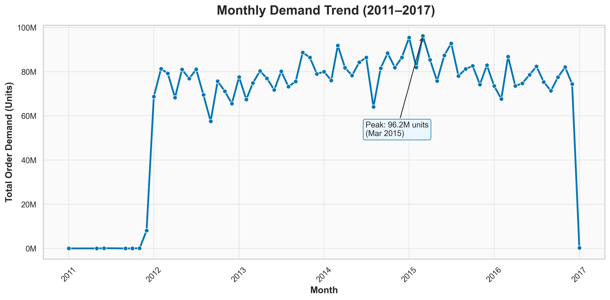
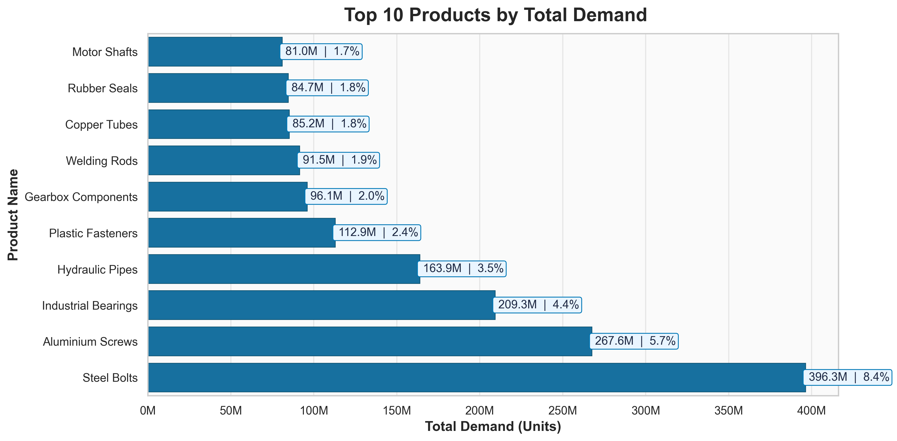
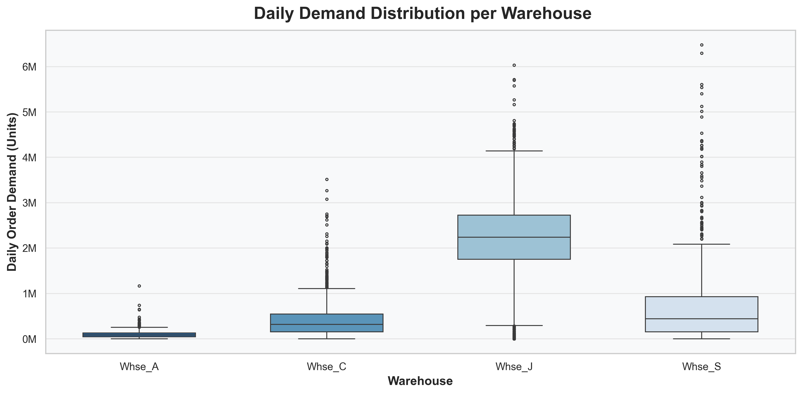
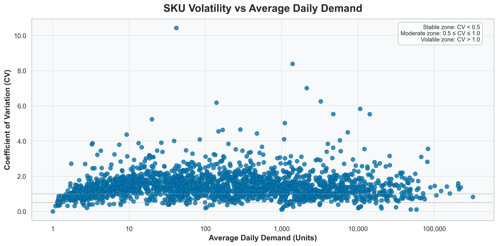
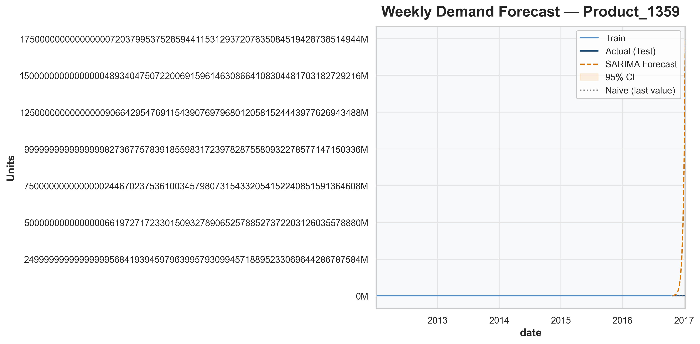
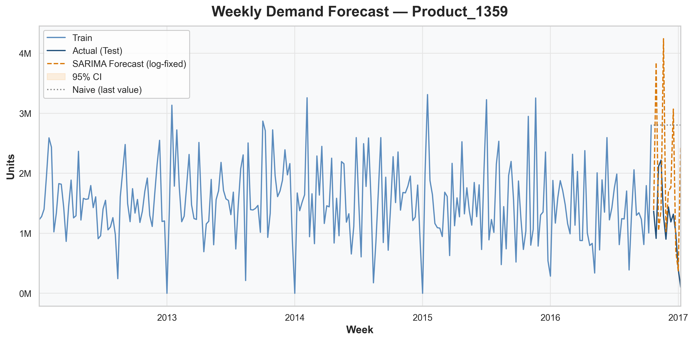

# 🏭 Inventory Demand Analysis & Forecasting

### Data Analysis Project in Logistics & Supply Chain

This project explores **demand forecasting optimization** using real-world product demand data.  
The goal is to identify trends, analyze SKU and warehouse-level variability, and build a short-term forecasting model  
to improve operational planning and inventory efficiency.

---

## 📦 Project Overview

In modern supply chains, accurate demand forecasting is critical for minimizing overstock, reducing stockouts,  
and improving service levels. Using Python, this notebook performs a **data-driven exploration and forecast modeling**  
of product demand trends across warehouses.

**Key Objectives:**
1. Explore overall demand trends and seasonal patterns.  
2. Identify which products and warehouses drive total demand.  
3. Compare warehouse demand variability and operational load.  
4. Assess SKU-level stability (stable vs volatile demand).  
5. Forecast near-term demand for strategic inventory planning.

---

## 📊 Exploratory Data Analysis (EDA)

### **1️⃣ Overall Demand Trends**
Visualizing monthly order demand to identify long-term patterns and seasonal fluctuations.

**Insight:**  
Demand shows consistent growth between 2011–2016, with clear cyclical peaks suggesting seasonality —  
useful for proactive inventory management.

---

### **2️⃣ Top Products and Warehouse Demand**

#### Top 10 Products by Demand

#### Warehouse Demand Distribution

**Insight:**  
High-demand SKUs like **Steel Bolts**, **Aluminium Screws**, and **Industrial Bearings** dominate total order volume.  
Among warehouses, **Warehouse J** handles the highest throughput and variability,  
indicating a hub role in the supply network.

---

### **3️⃣ Warehouse Operational Variability**

**Insight:**  
Boxplots show that **Warehouse J** experiences greater fluctuations compared to **Warehouse A**,  
which handles smaller, stable volumes — supporting differentiated stocking strategies.

---

### **4️⃣ SKU Stability (Volatility vs Predictability)**

**Insight:**  
A **Coefficient of Variation (CV)** scatter plot differentiates stable SKUs (predictable demand)  
from volatile ones (erratic patterns).  
Stable SKUs support lean inventory policies, while volatile ones require flexible replenishment plans.

---

### **5️⃣ Near-Term Forecasting (Steel Bolts / Product_1359)**

#### ❌ Initial SARIMA Model (Unstable)

> The first model diverged (“exploded”) due to large-scale non-stationary data.  
> This demonstrates why **variance stabilization** is essential in time-series forecasting.

#### ✅ Log-Stabilized SARIMA Forecast

**Insight:**  
After applying a log-transform (`log1p`), the SARIMA model successfully captured weekly seasonality  
and short-term variability for **Steel Bolts (Product_1359)**.  
It provided realistic confidence intervals, enabling near-term inventory planning with uncertainty quantification.

---

## 📈 Summary of Key Findings

| **Business Question** | **Findings & Insights** |
|------------------------|--------------------------|
| **1. What are the overall demand trends and seasonal patterns?** | The **Monthly Demand Trend** visualization revealed steady demand growth (2011–2016) with cyclical fluctuations. These recurring peaks indicate predictable sales patterns that can guide proactive restocking. |
| **2. Which products (SKUs) and warehouses drive the majority of total demand?** | The **Top 10 Products** and **Warehouse Distribution** visuals show that SKUs such as *Steel Bolts*, *Aluminium Screws*, and *Industrial Bearings* dominate total demand, while **Warehouse J** handles the largest share and variability of orders. |
| **3. How do different warehouses compare in demand variability and operational load?** | **Warehouse J** shows the highest variability, suggesting it serves as a regional hub. In contrast, **Warehouse A** handles smaller, more stable volumes — implying more predictable operations. |
| **4. How stable or volatile are different SKUs across time?** | The **CV Scatter Plot** revealed that most SKUs fall within moderate volatility (CV ≈ 0.5–1.0). However, a few SKUs are highly volatile and require adaptive safety-stock policies. |
| **5. How can we forecast near-term demand for planning and inventory optimization?** | A **log-stabilized SARIMA** model successfully forecasted demand for *Steel Bolts (Product_1359)*, capturing seasonal spikes and establishing confidence intervals for data-driven inventory planning. |

---

## 🧠 Final Takeaways

- **Operational Efficiency:** Focus optimization on top-performing SKUs and high-volume warehouses.  
- **Risk Management:** Implement tiered safety-stock policies for stable vs volatile SKUs.  
- **Model Stability:** Variance stabilization (`log1p`) significantly improves SARIMA forecast performance.  
- **Scalability:** The pipeline can be extended for multi-SKU forecasting and integrated into Power BI dashboards.

---

## 📂 Dataset Source

This project uses the **Product Demand Forecasting** dataset from Kaggle:  
👉 [Product Demand Forecasting — Kaggle Dataset](https://www.kaggle.com/datasets/felixzhao/productdemandforecasting)

**About the Dataset:**  
The dataset contains historical product demand data across multiple warehouses and SKUs,  
making it suitable for demand forecasting, inventory management, and operational optimization studies.

---

## ⚙️ Tools & Libraries
- **Python:** pandas, numpy, matplotlib, seaborn, statsmodels  
- **Techniques:** EDA, visualization, coefficient of variation (CV), SARIMA forecasting  
- **Environment:** Jupyter Notebook  

---

## 👨‍💻 Author
**Mutahher Naseer**

---

## 📫 Contact

- **Email:** [mutahhar.you@gmail.com](mailto:mutahhar.you@gmail.com)  
- **LinkedIn:** [Mutahher Naseer](https://www.linkedin.com/in/mutahher-naseer-30778b220)
